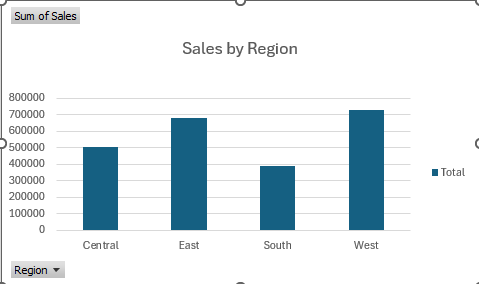

# Superstore Sales & Profit Analysis

## Overview
This project is an **Excel-based sales and profit analysis** using the Sample Superstore dataset.  
The analysis was performed using **pivot tables and pivot charts** to understand sales performance, profit distribution, and monthly trends.

This project demonstrates basic data analysis and visualization skills using Microsoft Excel.

---

## KPIs Analyzed
- Sales by Region
- Profit by Category
- Monthly Sales Trend

---

## Tools Used
- Microsoft Excel
- Pivot Tables
- Pivot Charts

---

## Visual Analysis

### Sales by Region
This chart shows total sales across different regions.

- West region has the highest sales
- South region has comparatively lower sales

---

### Profit by Category
This chart shows profit contribution by product category.

- Technology is the most profitable category
- Office Supplies has moderate profit
- Furniture has the lowest profit

---

### Monthly Sales Trend
This chart shows sales trends across months.

- Sales fluctuate throughout the year
- Higher sales are observed toward the end of the year

---

## Key Learnings
- Pivot tables help summarize large datasets
- Charts make trends easier to understand
- Sales and profit vary by region and category

---

## Author
Julia Reddy

---

## Disclaimer
This project is created for learning and portfolio purposes using a publicly available dataset.
